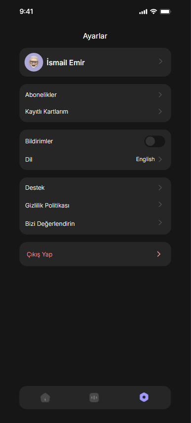
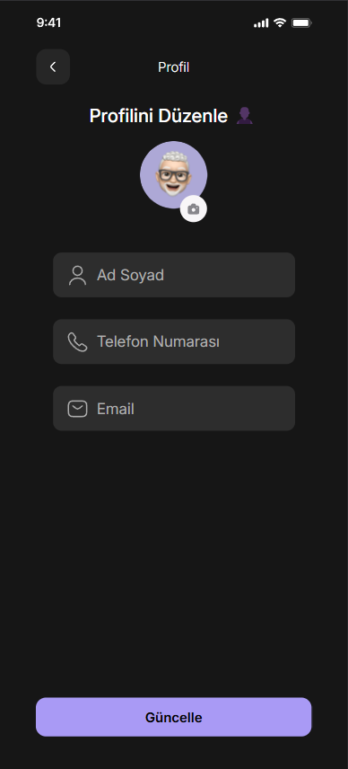
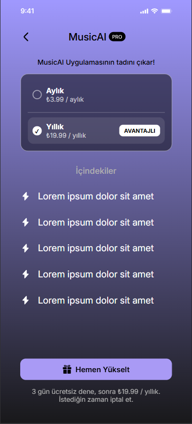

# 🎵 MusicAI Mobil Uygulama Arayüzü Eterna Case

## 📱 Proje Hakkında

MusicAI - Eterna Case, yapay zeka destekli bir müzik uygulamasının modern ve kullanıcı dostu arayüzünü sergileyen bir prototip projedir. Bu projeyi Eterna şirketi için case study olarak geliştirdim.

## 🎯 Özellikler

- 🔐 Kullanıcı profil sayfası
- 💳 Abonelik sistemi sayfası
- 🔔 Ayarlar / Ana Sayfası
- 📱 Responsive tasarım

## 🖼️ Ekran Görüntüleri

| Ana Sayfa | Abonelik | Profil |
|-----------|----------|---------|
|  |  |  |

## 🎥 Demo Video

![MusicAI Demo Video]

## 🛠️ Kullanılan Teknolojiler

- HTML5
- CSS3
- JavaScript
- CSS Grid & Flexbox
- Mobile-First Yaklaşımı
- CSS Custom Properties
- Responsive Design


## 🚀 Kurulum

1. Projeyi klonlayın:
```bash
git clone https://github.com/Lambersonistaken/eterna-case.git
```

2. Proje dizinine gidin:
```bash
cd eterna-case
```

3. Live Server veya benzer bir araç ile projeyi çalıştırın.

## 📱 Responsive Tasarım

Uygulama, farklı ekran boyutlarına uyum sağlayacak şekilde tasarlanmıştır:

- Mobil öncelikli tasarım
- Esnek ve uyarlanabilir bileşenler

## 🎨 Renk Paleti

- Ana Renk: `#a99af5`
- Arka Plan: `#161616`
- İkincil Arka Plan: `#262626`
- Metin Rengi: `#FFFFFF`
- Vurgu Rengi: `#00c853`


## 📝 Lisans

Bu proje MIT lisansı altında lisanslanmıştır. Daha fazla bilgi için `LICENSE` dosyasına bakınız.

---

### 🌟 Geliştirici Notu

Bu proje, modern web teknolojilerini kullanarak mobil öncelikli bir tasarım yaklaşımıyla geliştirilmiştir. Kullanıcı deneyimini ön planda tutarak, temiz ve anlaşılır bir kod yapısı hedeflenmiştir.
